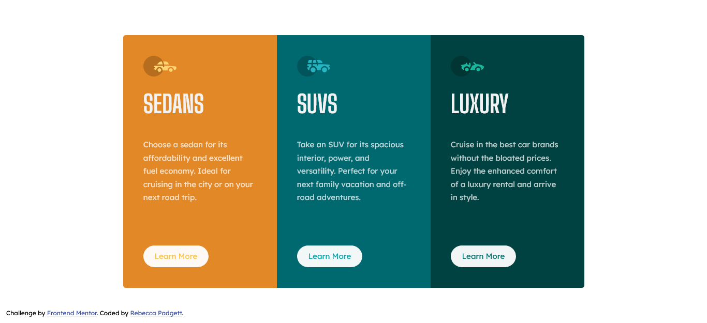

# Frontend Mentor - 3-column preview card component solution

This is a solution to the [3-column preview card component challenge on Frontend Mentor](https://www.frontendmentor.io/challenges/3column-preview-card-component-pH92eAR2-). Frontend Mentor challenges help you improve your coding skills by building realistic projects.

## Table of contents

- [Overview](#overview)
  - [The challenge](#the-challenge)
  - [Screenshot](#screenshot)
  - [Links](#links)
- [My process](#my-process)
  - [Built with](#built-with)
  - [What I learned](#what-i-learned)
  - [Continued development](#continued-development)
  - [Useful resources](#useful-resources)
- [Author](#author)
- [Acknowledgments](#acknowledgments)

## Overview

### The challenge

Users should be able to:

- View the optimal layout depending on their device's screen size
- See hover states for interactive elements

### Screenshot

### Links

- Solution URL: [Frontend Mentor](https://www.frontendmentor.io/solutions/3column-preview-card-component-using-html-and-css-91WCMbk9KT)
- Live Site URL: [Github Pages](https://bccpadge.github.io/3-column-preview-card-component/)

## My process

### Built with

- Semantic HTML5 markup
- CSS custom properties
- CSS Grid
- Mobile-first workflow

### What I learned

When building this project, I learned you can inspect accessibilty properties in Firefox to check errors.

### Continued development

I want to continue to implement more accessibility features in future projects.

### Useful resources

- [Text labels and names](https://developer.mozilla.org/en-US/docs/Web/Accessibility/Understanding_WCAG/Text_labels_and_names) - I got an error of texl label on the figure tags and used figcaption tag to fix this issue.

## Author

- Frontend Mentor - [@bccpadge](https://www.frontendmentor.io/profile/bccpadge)
- Github - [@bccpadge](https://github.com/bccpadge)

## Acknowledgments

I want to give a shout to Fer on Frontend Mentor his 3-column preview card component helped with the buttons in this challenge. Go check out his profile: [Fer](https://www.frontendmentor.io/profile/fernandolapaz)
